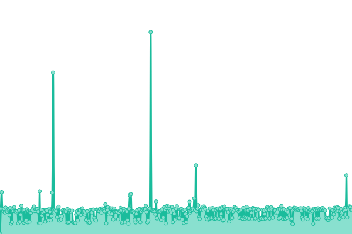
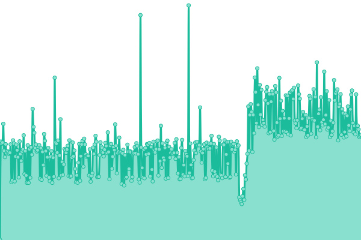

# [📈 Live Status](https://SRESchool.github.io/AllWizbrand-monitor-upptime): <!--live status--> **🟧 Partial outage**

This repository contains the open-source uptime monitor and status page for [SRESchool](https://SRESchool.github.io/AllWizbrand-monitor-upptime), powered by [Upptime](https://github.com/upptime/upptime).

With [Upptime](https://upptime.js.org), you can get your own unlimited and free uptime monitor and status page, powered entirely by a GitHub repository. We use [Issues](https://github.com/SRESchool/AllWizbrand-monitor-upptime/issues) as incident reports, [Actions](https://github.com/SRESchool/AllWizbrand-monitor-upptime/actions) as uptime monitors, and [Pages](https://SRESchool.github.io/AllWizbrand-monitor-upptime) for the status page.

<!--start: status pages-->
<!-- This summary is generated by Upptime (https://github.com/upptime/upptime) -->
<!-- Do not edit this manually, your changes will be overwritten -->
<!-- prettier-ignore -->
| URL | Status | History | Response Time | Uptime |
| --- | ------ | ------- | ------------- | ------ |
|  [AIRegistry](https://airegistry.co) | 🟩 Up | [ai-registry.yml](https://github.com/SRESchool/AllWizbrand-monitor-upptime/commits/HEAD/history/ai-registry.yml) | 

 293ms
     
 | 

<a href="https://SRESchool.github.io/AllWizbrand-monitor-upptime/history/ai-registry">100.00%</a>
    

|  [GuestPostAI](https://guestpostai.com) | 🟥 Down | [guest-post-ai.yml](https://github.com/SRESchool/AllWizbrand-monitor-upptime/commits/HEAD/history/guest-post-ai.yml) | 

 0ms
     
 | 

<a href="https://SRESchool.github.io/AllWizbrand-monitor-upptime/history/guest-post-ai">0.00%</a>
    

|  [Wizbrand](https://wizbrand.com) | 🟥 Down | [wizbrand.yml](https://github.com/SRESchool/AllWizbrand-monitor-upptime/commits/HEAD/history/wizbrand.yml) | 

 0ms
     
 | 

<a href="https://SRESchool.github.io/AllWizbrand-monitor-upptime/history/wizbrand">0.00%</a>
    

|  [GurukulGalaxy](https://gurukulgalaxy.com) | 🟩 Up | [gurukul-galaxy.yml](https://github.com/SRESchool/AllWizbrand-monitor-upptime/commits/HEAD/history/gurukul-galaxy.yml) | 

 750ms
     
 | 

<a href="https://SRESchool.github.io/AllWizbrand-monitor-upptime/history/gurukul-galaxy">99.40%</a>
    

|  [CMSGalaxy](https://cmsgalaxy.com) | 🟥 Down | [cms-galaxy.yml](https://github.com/SRESchool/AllWizbrand-monitor-upptime/commits/HEAD/history/cms-galaxy.yml) | 

 638ms
     
 | 

<a href="https://SRESchool.github.io/AllWizbrand-monitor-upptime/history/cms-galaxy">0.64%</a>
    

<!--end: status pages-->

[**Visit our status website →**](https://SRESchool.github.io/AllWizbrand-monitor-upptime)

## 📄 License

- Powered by: [Upptime](https://github.com/upptime/upptime)
- Code: [MIT](./LICENSE) © [Anand Chowdhary](https://anandchowdhary.com), supported by [Pabio](https://pabio.com)
- Data in the `./history` directory: [Open Database License](https://opendatacommons.org/licenses/odbl/1-0/)
